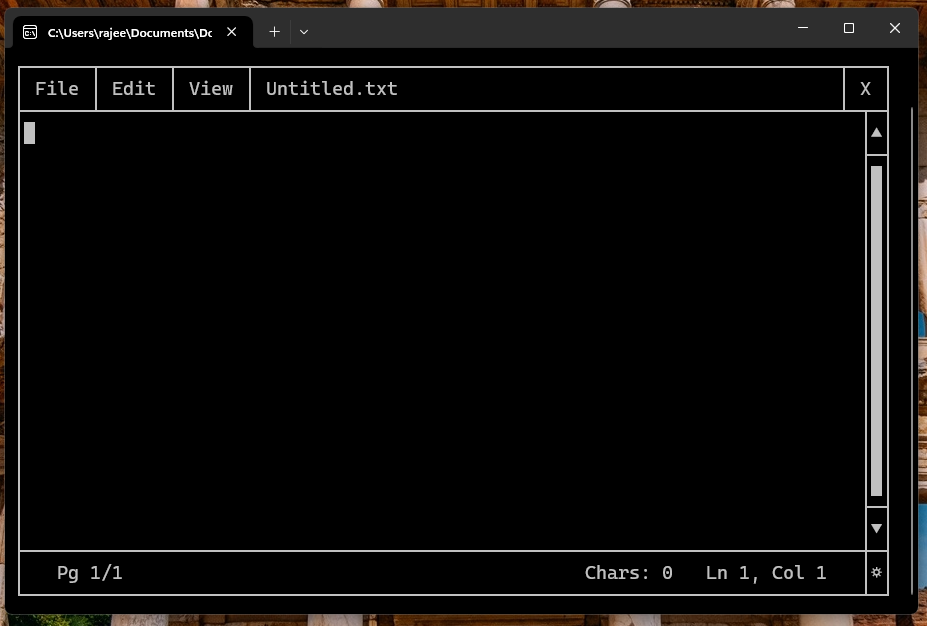
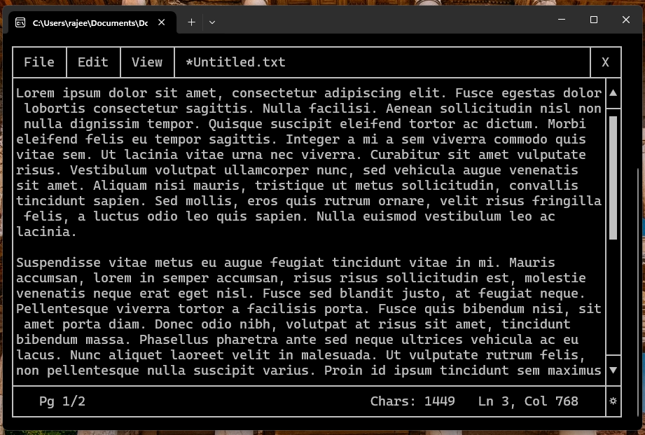
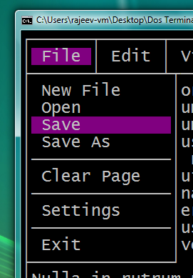
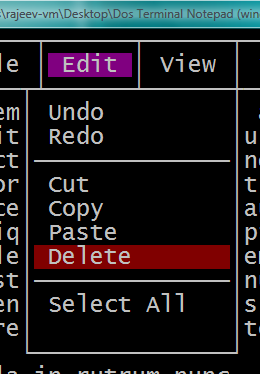
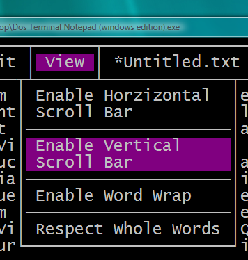
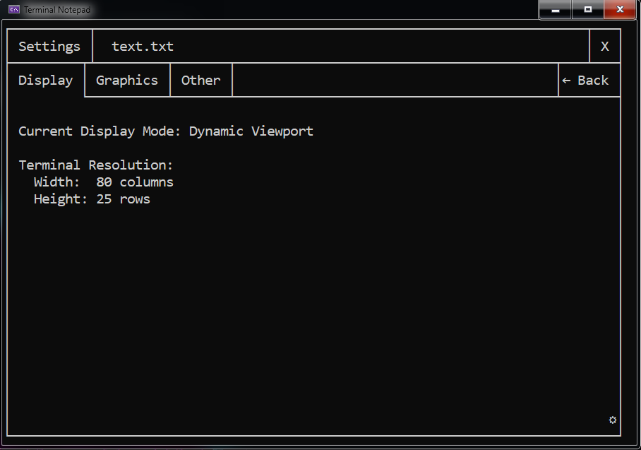
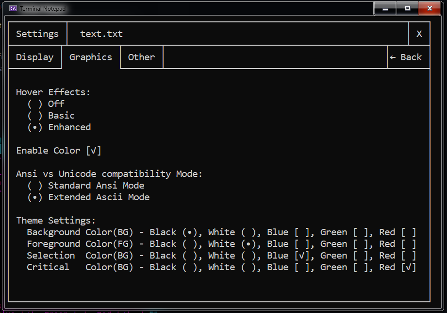
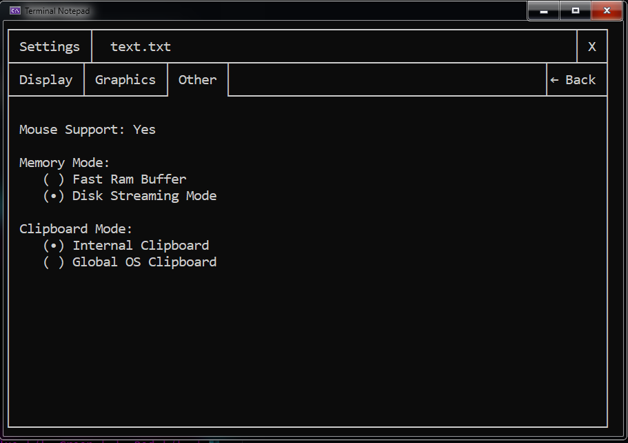
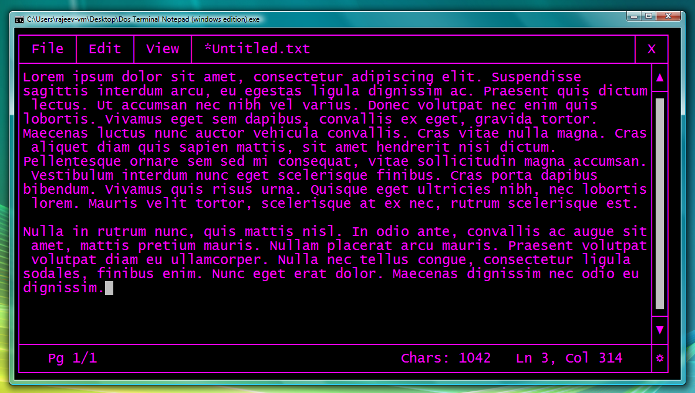

# Terminal-Notepad-Win
Terminal-Notepad-Win is a text editor inspired by Windows Notepad and a port of Terminal-Notepad-Dos, built entirely from scratch in C++, compiled with Visual Studio, and with the help of Google Gemini for Windows ConHost and Windows Terminal. It brings a modern, Windows-like GUI experience to Windows CMD. Yes, I know that the whole program is made with the help of AI. Because I'm not good at coding at this level, I only know how to design the user interface, and I love a DOS and retro-futuristic aesthetic.

Designed mainly for mouse-based usage, but keyboard navigation is completely supported.

Main Screen, running under Windows 11

Preview with demo text

Menus preview

  .    .   

# Features of the application:

Core Engine & Architecture:

 - Win32 API Rendering: Uses low-level SetConsoleCursorPosition and Console Screen Buffers to bypass standard cout scrolling, achieving instant, flicker-free UI updates.

 - Native Mouse Input: Captures raw MOUSE_EVENT_RECORD data for precise tracking, enabling click-and-drag text selection, scroll wheel support, and interactive UI buttons.

 - Smart Terminal Resizing: Actively monitors the console window size. If the user shrinks the terminal below the required 80x25 grid, the app safely pauses and prompts them to resize it, preventing UI corruption.

 - UTF-8 & Legacy ASCII Support: Sets the console codepage to 65001 (UTF-8) for beautifully smooth box-drawing borders, with a built-in toggle to fall back to standard ASCII symbols.

Advanced Editing Capabilities:

 - Global OS Clipboard Integration: Unlike the DOS version, which is isolated, Terminal-Notepad-Win connects directly to the Windows OS clipboard (Ctrl+C / Ctrl+V). You can copy text from Chrome or Notepad and paste it directly into the terminal! (Includes a toggle to use an internal-only clipboard if preferred).

 - Deep Undo/Redo Engine: A robust 100-level deep state machine that smartly groups your typing bursts together so you don't have to hit undo for every single character.

 - Dynamic Word Wrap Engine: Automatically reflows text based on the window bounds, with customizable logic to break at exact character limits or respect whole words.

Modern UI/UX in the Terminal:

 - Win32 File Browser: Uses native FindFirstFile APIs to build a fully functional, clickable file explorer inside the console. Includes dynamic search filtering, directory traversal, and path history.

 - Comprehensive Keyboard Shortcuts: Fully embraces modern conventions with Ctrl+N (New), Ctrl+O (Open), Ctrl+S (Save), alongside Alt-key menu dropdowns and Tab traversal.

 - Cross-Compatible Theming: Reads and writes to the exact same config.txt file as the DOS version. Change your color scheme or scrollbar settings here, and the DOS version will instantly match it.

# Settings page
Display Settings

Graphics Settings

Other Settings

# Requirements
Windows Vista x64 or above with either ConHost or Windows Terminal in Windows 10/11.

# Tested on

Windows Vista x64 (right click on the title bar of the console -> properties -> go to font use Lucida Console -> click on ok for the program to work properly, resizing is not possible)

Windows 7 x64 (right click on the title bar of the console -> properties -> go to font use Lucida Console -> click on ok for the program to work properly, resizing is not possible)

Windows 10 x64 (Works perfectly on both ConHost and Windows Terminal)

Windows 11 x64 (Works perfectly on both ConHost and Windows Terminal)

# Running under Windows Vista

